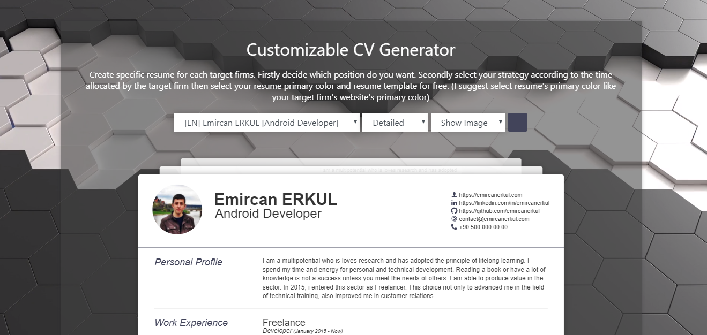

# Customizable CV Generator

Create specific resume for each target firms. Firstly decide which position do you want. Secondly select your strategy according to the time allocated by the target firm then select your resume primary color and resume template.



## Requirement
* Web enviroment (Xammpp, Wamp etc.) and [Wkhtmltopdf](https://github.com/wkhtmltopdf/wkhtmltopdf)
* or
* [Docker](https://www.docker.com/get-started)

## Installation via Traditional Method
* Install [Wkhtmltopdf](https://github.com/wkhtmltopdf/wkhtmltopdf)
* Download [git repo](https://github.com/emircanerkul/cvgen/archive/master.zip) on your local webserver folder
* Create your profile.json file

## Installation via Docker (Suggested)
* docker build --no-cache=true --build-arg BUILD_DATE=$(date -u +'%Y-%m-%dT%H:%M:%SZ') -t cvgen:latest .
* docker run --rm -it -p 80:80 -v $(pwd):/var/www/html cvgen (on linux) or
* docker run --rm -it -p 80:80 -v ${pwd}:/var/www/html cvgen (in powershell) or
* docker run --rm -it -p 80:80 -v %cd%:/var/www/html cvgen (in cmd)

## Profile File CVGen Schema

```json
{
    "@context": "http://github.com/emircanerkul/cvgen",
    "@type": "CVGen",
    "lang": "tr/en/?:fill->translation.json",
    "name": "String",
    "surname": "String",
    "expertise": "String",
    "born": "String",
    "gender": "String",
    "email": "String@email",
    "website": "String@url",
    "linkedin": "String@url",
    "github": "String@url",
    "phone": "String",
    "photo": "String@filename",
    "about": {
        "detailed": "String@LongText",
        "important": "String@ShortText"
    },
    "education": [
        {
            "organization": "String",
            "department": "String",
            "degree": "String",
            "date_at": "String@year",
            "date_from": "String@year"
        }
    ],
    "experience": [
        {
            "organization": "String",
            "qualification": "String",
            "date_at": "String@date",
            "date_from": "String@date",
            "excerpt": "String@ShortText"
        },
        {
            "organization": "String",
            "qualification": "String",
            "date_at": "String@date",
            "date_from": "String@date",
            "excerpt": "String@ShortText"
        }
    ],
    "certificate": [
        {
            "organization": "String",
            "qualification": "String",
            "date_at": "String@date",
            "date_from": "String@date",
            "excerpt": "String@shortText"
        }
    ],
    "abilities": [
        {
            "ability": "String",
            "level": 9
        },
        {
            "ability": "String",
            "level": 6
        },
        {
            "ability": "String",
            "level": 8
        }
    ],
    "projects": [
        {
            "title": "String",
            "excerpt": "String",
            "used": "String"
        },
        {
            "title": "String",
            "excerpt": "String",
            "used": "String"
        }
    ],
    "languages": [
        {
            "title": "String",
            "qualification": "String"
        }
    ],
    "hobbies": [
        {
            "title": "String",
            "icon":"String@icon:[study,pen,music1]",
            "excerpt": "String"
        }
    ]
}
```

## Profile File Tagging

* If you want to tag variable you just turn into object.
```json
"about": {
        "detailed": "More detailed long text here",
        "important": "Short text here"
    }
```

* If you want to tag object you just add tag value on object.
```json
"certificate": [
        {
            "organization": "String",
            "qualification": "String",
            "date_at": "String@date",
            "date_from": "String@date",
            "excerpt": "String@shortText",
            "tag": "detailed"
        }
    ]
```

## Template Engine

* Language Variable I&=VARKEY1=&I
* Profile Variable I%=VARKEY2=%I
* Profile Array Starts: I%=VARKEY3=I Ends: I=VARKEY3=%I
```html
I%=experience=I
<article>
    <h2>I%=organization=%I</h2>
    <p class="sub-details">
        <span>I%=qualification=%I</span>
        (I%=date_at=%I - I%=date_from=%I)
    </p>
    <p class="excerpt">I%=excerpt=%I</p>
</article>
I=experience=%I
```

## Thank you
* [Ashish Kulkarni](https://github.com/ashkulz) & [Jakob Truelsen](https://github.com/antialize) and [others](https://github.com/wkhtmltopdf/wkhtmltopdf/graphs/contributors) for [Wkhtmltopdf](https://github.com/wkhtmltopdf/wkhtmltopdf)
* [Thomas Hardy](http://www.thomashardy.me.uk) for [html resume template](http://www.thomashardy.me.uk/free-responsive-html-css3-cv-template)
* [Simon](https://github.com/Simonwep/) for [color picker plugin](https://github.com/Simonwep/pickr)
* [webloopshub](https://pixabay.com/tr/users/webloopshub-12869313/?tab=videos) from [Pixebay](https://pixabay.com/videos/3d-rendering-movement-design-24717/) for background video
* [Icomoon](https://icomoon.io) for icons
* [Icon8](https://icons8.com) for favicon

## License
[](http://badges.mit-license.org)
